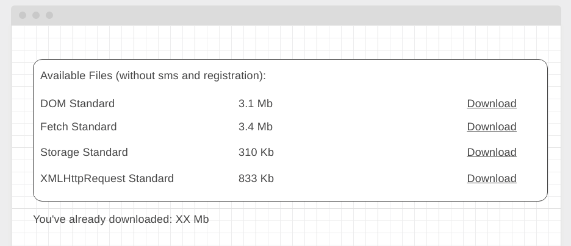

#### Deployment: https://sergius92739.github.io/ahj-6.3-dnd/

### Download Manager (задача со звёздочкой)

Важно: эта задача не является обязательной

#### Легенда

Вы делаете веб-интерфейс к облачному хранилищу данных (Dropbox, Google Drive, Yandex Disk, Mail.ru Облако), с которого можно скачивать книги (обратите внимание, никакого пиратского контента, только свободно распространяемый материал). И вам нужно реализовать интерфейс для скачивания средствами JS.

Подсказка: храните контент файлов предзашитым в виде DataURL в теле страницы (тяжёлые файлы специально убраны).

Но при этом также нужно показать пользователю, сколько мегабайт он уже скачал.

#### Описание

Внешний вид должен выглядеть следующим образом:

PDF-файлы для реализации вы найдёте в каталоге files данного репозитория.

Обратите внимание, что скачивание должно производиться средствами JS и подсчёт количества скачанных мегабайт должен производиться на базе реально скачанного контента (а не тех размеров, что указаны в табличке).

При этом если одна книжка скачивается дважды, то и учитываться в обьёме скачанного она должна также дважды.
